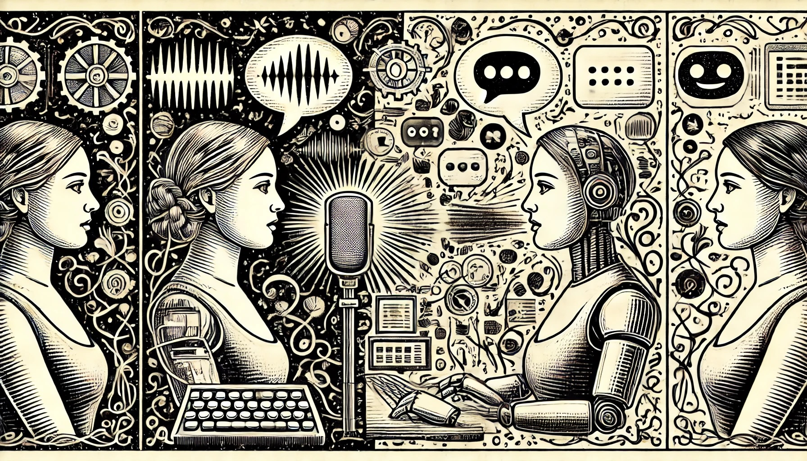

keywords: Chatbot, Assistant, 聊天機器人, 虛擬助理

# 聊天機器人與語音助理

隨著 ChatGPT 問世，大家已經熟悉了所謂的聊天機器人（Chatbot）以及生成式 AI。聊天機器人與虛擬助理其實出自於相同的概念與技術，但是在實際應用上有些許的不同。

根據維基百科，所謂的聊天機器人是「一種設計用來模仿栩栩如生的人類文字或語音互動的軟體或是網頁介面」[^chatbot]，至於虛擬助理，則是「根據使用者的命令或是問題等輸入，包括語言輸入，而執行一系列工作或是服務的軟體。 」 此外，「虛擬助理的技術通常會用到聊天機器人的能力，用以模擬人際對話。」[^virtual_assistant]，根據這樣的定義，我們可以知道兩者之間都具備與使用者對話的能力，但是虛擬助理會在聊天機器人的基礎上，多出可以執行工作，可以呼叫語音系統以外的程式。像是，如果是導航用的助理，就需要能夠向外呼叫地圖或導航的 SDK。

要能夠順利完成這些工作，虛擬助理—無論是文字助理或語音助理—在了解到用戶想進行某項工作的意圖時，就得進入一套系統化的流程，而不能像是聊天機器人一樣，由於只需要進行對話，所以就可以天南地北地閒聊。

由於 ChatGPT 與 Gemini 等服務都已經開放了 API，在這些服務的範例中，我們可以輕鬆開發出一套聊天機器人，而我們現在還要更進一步，把語音助理可以可以執行的任務區分出來，至於這些任務以外的部分，我們仍然可以交給 LLM 處理，讓 LLM 產生各種回答。

而怎樣「了解、區分出這是一件可以讓語音助理執行的工作」，我們其實也可以用 LLM 的能力達成—過去，人們已經用了一些好幾代之前的技術，打造了許多的語音助理，應用了新的 LLM，我們相信能夠打造出更好的語音助理。

[^chatbot]: https://en.wikipedia.org/wiki/Chatbot
[^virtual_assistant]: https://en.wikipedia.org/wiki/Virtual_assistant
