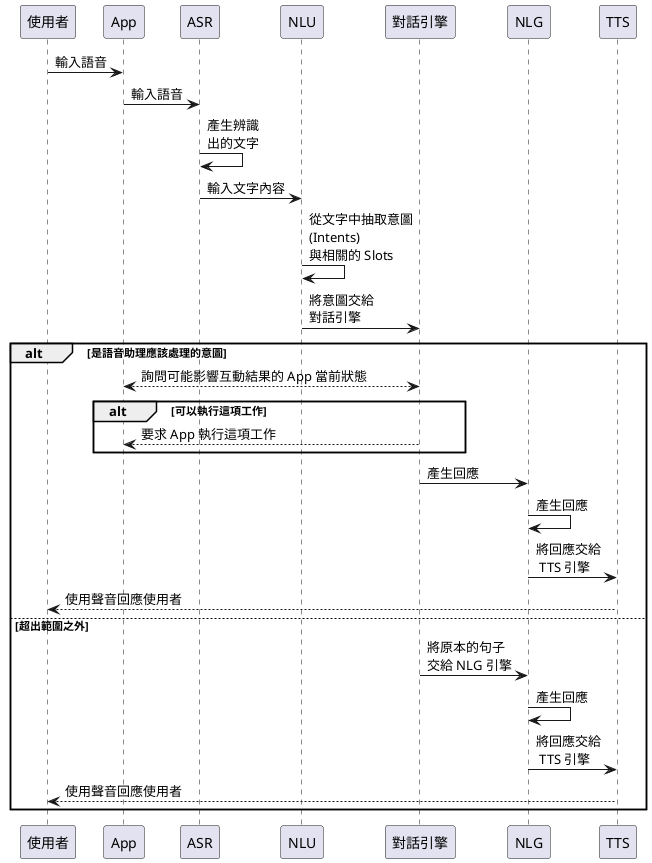
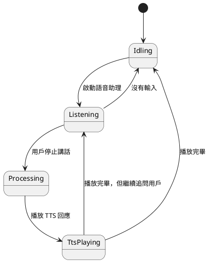

# 語音助理的基本組成

在這邊需要介紹一些專有名詞。一套語音助理系統的組成，通常會包括—ASR、NLU、NLG、TTS 等，在一個完整的語音互動中，扮演各自的角色。

- ASR：Automatic Speech Recognition，自動語音識別，又稱為 STR （Speech-to-Text），負責將語音訊號轉換為文字。對於行動開發者來說，應該清楚蘋果提供了 [Sppech](https://developer.apple.com/documentation/speech) 框架，在 Android 系統中也有 [SpeechRecognizer](https://developer.android.com/reference/android/speech/SpeechRecognizer) 可用，在瀏覽器中也一樣有 [SpeechRecognition](https://developer.mozilla.org/en-US/docs/Web/API/SpeechRecognition)。除此之外，許多雲端服務，像是 Google Cloud 與 Azure，也具備將上傳的語音資料轉換成文字的服務。
- NLU：Natural Language Understanding，自然語言理解，負責從文字中抽取出意圖，像是知道使用者想要做什麼事情，想要問什麼問題，也可以分析用戶所說的話當中的情緒（悲傷、高興、憤怒），或是口吻是正式還是輕鬆等。在行動開發的框架中，通常沒有這部份的框架，但是所有的交談型 LLM 都一定包含 NLU 的能力。此外，比較有名的 NLU 引擎包括 [Google Dialogflow](https://cloud.google.com/dialogflow/docs/)、[Microsoft LUIS](https://learn.microsoft.com/en-us/azure/ai-services/luis/)、[IBM Watson](https://www.ibm.com/products/natural-language-understanding)、[Nuance Recognizer](https://www.nuance.com/omni-channel-customer-engagement/contact-center-ai/nuance-recognizer.html) 等等。
- NLG：Natural Language Generation，自然語言生成，負責產生對特定文字的回覆。其實各種 LLM，就是在擔任 NLG 引擎的工作。
- TTS：Text-to-Speech。負責將文字轉換為語音。在行動開發者的框架中，蘋果提供了 [AVSpeechSynthesizer](https://developer.apple.com/documentation/avfoundation/avspeechsynthesizer)、Google 提供了 [TextToSpeech](https://developer.android.com/reference/android/speech/tts/TextToSpeech)。在瀏覽器中，也有 [SpeechSynthesis](https://developer.mozilla.org/en-US/docs/Web/API/SpeechSynthesis) 可用。雲端服務中，像是 Google Cloud 與 Azure 也提供了將文字轉換成語音的服務。

## 各種組件的分工

在執行一段語音助理的工作流程中，各個組件的分工如下：



在上圖中，多了一個叫做「對話引擎」的角色，也就是我們需要自行開發的部分。對話引擎需要負責管理一份對應表格（mapping），將各種從 NLU 引擎抽取出的意圖，對應到我們的語音助手可以執行的工作上。如果不能處理這項工作（像用戶只說了「你好」，但是我們沒辦法用「你好」這句話決定可以做什麼事），我們可以有幾個選擇，或是就直接用 TTS 告訴用戶我們不理解你的意圖，或是就由 NLU 引擎產生一個回答，這樣會讓用戶感到比較親切。

至於是可以執行的工作，就會走入一套我們設計好的對話流程。我們在後面再詳細討論。

## 狀態

從以上的流程圖中，我們也可以發現，對話引擎擁有以下幾種狀態：

- 閒置狀態：也是語音助理的初始狀態。
- 聆聽/辨識狀態：用戶從 App 啟動了麥克風，對系統輸入語音資料，同時 ASR 引擎也在嘗試辨識語音。通常等到用戶停止講話一陣子，我們架設用戶已經把想講的話說完，我們就會進入下一個狀態。而如果在一段時間內，用戶什麼話都沒說，或是沒有任何 ASR 辨識結果，我們也會離開這個狀態，回到閒置狀態，我們也可能用 TTS 提示用戶「我不能理解你的意思」。
- 處理狀態：我們將 ASR 辨識結果送到 NLU 引擎後，NLU 引擎往往需要一段時間分析，我們也往往需要獲得一些其他的資訊，才知道對話應該如何繼續進行。這段時間，我們通常會在 App 上顯示一個等待的畫面，或是用 TTS 提示用戶「我正在處理你的要求」。
- TTS 播報狀態：當我們用 TTS 回應用戶時，我們會進入這個狀態。這個狀態通常會持續一段時間，直到 TTS 播報完畢，我們才會回到閒置狀態。或是，如果我們需要繼續追問用戶，我們會回到聆聽/辨識狀態。



這些狀態還可以繼續細分，像是前面提到，處理階段中，也可以繼續拆成 NLU 處理中，或是在獲取額外資訊等階段。而 App 應該要監聽這些狀態，並且在不同的狀態下，顯示不同的畫面，或是提供不同的操作，以符合使用者的預期。

```dart
@immutable
abstract class DialogEngineState {}

/// Idling state
class DialogEngineIdling extends DialogEngineState {}

/// Listening state
class DialogEngineListening extends DialogEngineState {
  final String asrResult;
  DialogEngineListening({required this.asrResult});
}

/// Processing state
class DialogEngineCompleteListening extends DialogEngineState {
  final String asrResult;
  DialogEngineCompleteListening({required this.asrResult});
}

/// TTS playing state
class DialogEnginePlayingTts extends DialogEngineState {
  final String prompt;
  DialogEnginePlayingTts({required this.prompt});
}

```

## 介面設計

我們可以使用的各種 ASR、NLU、NLG、TTS 的服務非常多，除了各種已有的選擇之外，我們甚至可能會開發自己的服務，像是在我們自己的伺服器上放置我們自己調整過的模型。從開發對話引擎的角度來看，我們便應該專注於介面，而非個別服務的實作，我們只需要知道 ASR、NLU…每個引擎所具備的能力，而我們的對話引擎大概會像這樣：

- 有 ASR、NLU、NLG、TTS 四個引擎的實例
- 有可以讓外部監聽的狀態
- 有可以讓外部設定的對話流程

```dart
class DialogEngine implements VuiFlowDelegate {
  final AsrEngine asrEngine;
  final TtsEngine ttsEngine;
  final NluEngine nluEngine;
  final NlgEngine nlgEngine;

  final StreamController<DialogEngineState> _stateStream = StreamController();
  DialogEngineState _state = DialogEngineIdling();
  DialogEngineState get state => _state;
  Stream<DialogEngineState> get stateStream => _stateStream.stream;

  Map<String, VuiFlow> _vuiFlowMap = {};
}
```

### ASR

我們定義的 ASR 引擎像這樣：

```dart
enum AsrEngineState {
  listening,
  notListening,
  done,
}

abstract class AsrEngine {
  Future<bool> init();
  Future<bool> startRecognition();
  Future<bool> stopRecognition();
  Future<void> setLanguage(String language);

  Function(String, bool)? onResult;
  Function(AsrEngineState)? onStatusChange;
  Function(dynamic)? onError;
  bool get isInitialized;
}

```

### NLU
### NLG
### TTS


