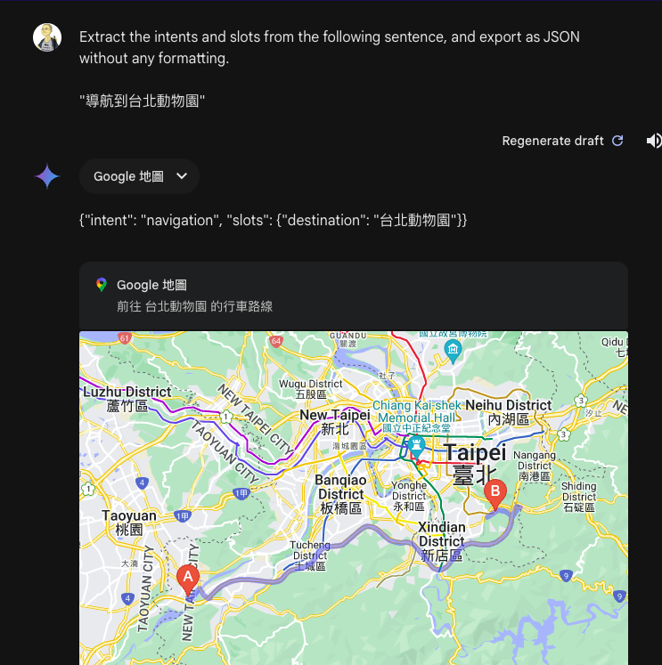
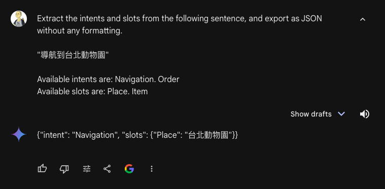
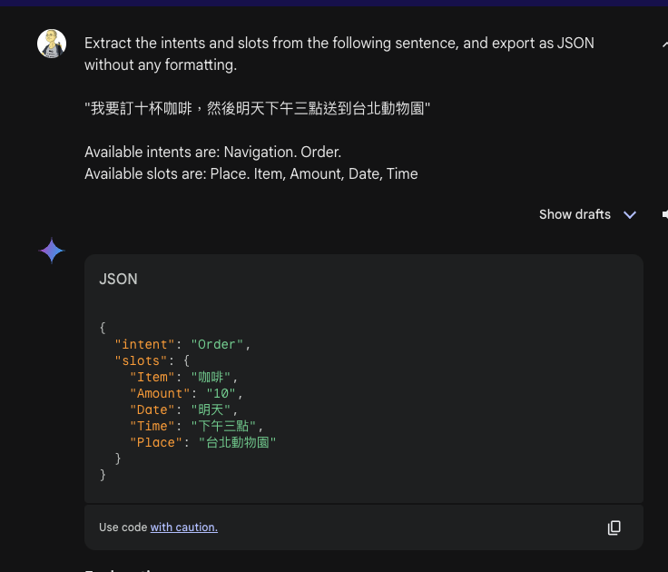
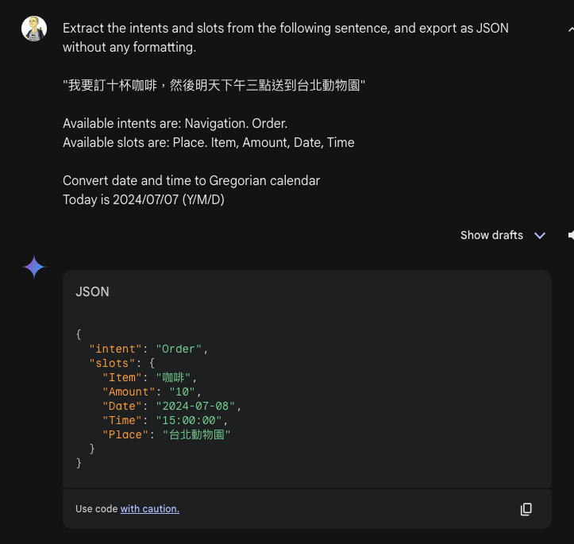
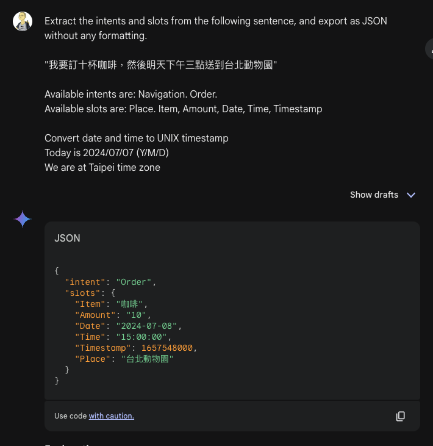
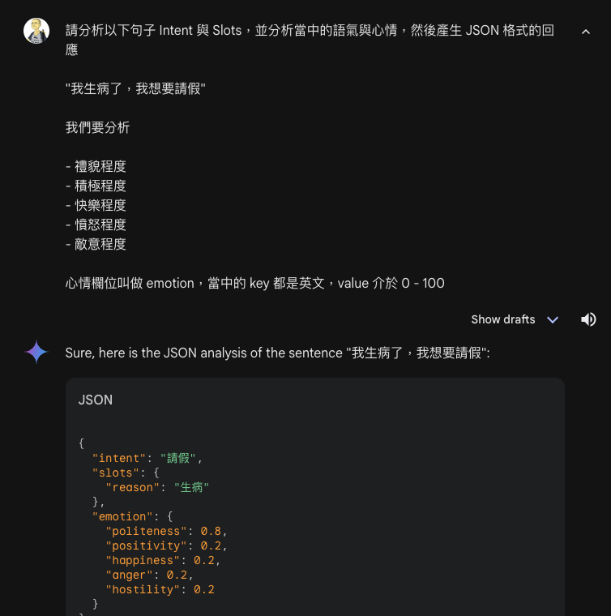

# 讓 Gemini 成為 NLU 與 NLG 引擎

這一節中，會說明如何實作我們的 NLU 與 NLG 引擎。這裡使用 Gemini 示範，也可以使用其他的 LLM。

## 抽取 Intent 與 Slots 的 Prompt

讓交談式的 LLM 成為 NLU 引擎其實十分簡單，就是下達與以下類似的 prompt：「請幫我從以下這句話當中抽取出 Intent 與 Slots，然後輸出成 JSON 格式，不要其他的輸出內容」。

我們可以在 Gemini 或是 [Google AI Studio](https://ai.google.dev/aistudio) 的網頁介面中，就可以試試看我們的 prompt。下圖中，我們嘗試輸入「導航到台北動物園」這句話。



Gemini 幫我們成功抽取出「navigation」這個意圖，同時也抽取了目的地是「台北動物園」。不過，輸出結果比我們預期得還多，多出了 JSON 以外的地圖部分，但這沒關係，我們可以用用一個 Regular Expression 捕捉輸出結果中的 JSON 部分，然後用 Dart 本身的 JSON parser，轉換成我們需要的 Dart Map 物件。

## 限制 Intent 的名稱

在上面的範例中，我們雖然讓 Gemini 抽取出了 Intent，但是 Intent 是什麼名稱，完全讓 Gemini 決定，很有可能每次 Gemini 輸出的結果就會不太一樣，像是可能大小寫不一，可能 navigation 變成大寫的 Navigation 或 NAVIGATION。所以，我們可以多做一些補充，讓 Gemini 盡可能產生符合我們預期的結果。

比方說，我們希望導航的意圖固定是大寫的，然後導航的地點從 destination 這個字變成 Place，我們就可以在上面的 prompt 當中，



在 Gemini 的輸出結果中，就成為我們所預期指定的 Intent 與 Slot 名稱了。

## 處理省略指代

在我們的日常對話中，我們經常會用到[指代](https://zh.wikipedia.org/wiki/%E6%8C%87%E4%BB%A3)，像是「他」、「她」、「它」等等，代表某個具體的人或是物品，或是用「今天」、「昨天」、「明天」，代替某個具體的日期。如果只是用上面的 prompt，Gemini 仍然可以幫助我們抽取出這些 Slot，

比方說，我們想要處理「我要訂十杯咖啡，然後明天下午三點送到台北動物園」這句話，Gemini 給我們的結果如下：



「下午三點」與「明天」並不太方便我們做後續的處理，除了要把「下午三點」從中文轉換成一般程式的時間格式外，還需要從「明天」中推算出確實的日期。但，我們可以在 prompt 當中多提供一些線索，Gemini 就可以幫我們預先處理好。像是，我們就可以告訴 Gemini 今天是哪一天，然後要求把日期都轉換成西曆。



但很多時候，我們不能夠信賴 Gemini 或是各種 LLM 的能力，比方說，我們現在貪心一點，還想將日期轉換轉換成 UNIX timestamp，結果產生了 `1657548000`，但這其實是一個 2022 年的日期，這就不是我們所預期的結果，而且會造成後面系統的錯亂。



要增加哪些額外的 prompt，其實與我們計畫讓我們的語音助理有多少能力有關。在前面的例子中，如果我們的語音助理只需要負責導航相關的工作，那麼在處理訂單相關的這些跟日期有關的處理，其實都是不需要的，所以，我們的 NLU 引擎，應該具備動態根據需求，調整使用不同的 prompt 能力。

## 實作基於 Gemini 的 NLU 引擎

一個基於 Gemini 的 NLU 引擎的實作如下。由於使用 Gemini 需要一把 API key，我們設計了可以傳入 API key 的介面。

```dart
import 'dart:convert';

import 'package:google_generative_ai/google_generative_ai.dart';
import 'package:meta/meta.dart';

import '../interface/nlu_engine.dart';

@immutable
class GeminiNluEngineError implements Exception {
  final String message;

  const GeminiNluEngineError(this.message);

  @override
  String toString() {
    return '${super.toString()} $message';
  }
}

class GeminiNluEngine extends NluEngine {
  final String apiKey;
  GeminiNluEngine({
    required this.apiKey,
  });

  @override
  Future<NluIntent> extractIntent(
    String utterance, {
    String? currentIntent,
    String? additionalRequirement,
  }) async {
    final model = GenerativeModel(
      model: 'gemini-1.5-flash-latest',
      apiKey: apiKey,
    );

    var prompt =
        'Extract the intent and the slots for the sentence:\n\n$utterance\n\n';
    prompt += "The output is in JSON without any formatting.";
    prompt += "Valid intents are including: ${availableIntents.join(',')}.";
    if (currentIntent != null) {
      prompt += "The current indent is $currentIntent.";
    }
    prompt += "Valid slots are including: ${availableSlots.join(',')}.";
    prompt += "If the intent is not in the valid intents, return null.";
    if (additionalRequirement != null) {
      prompt += additionalRequirement;
    }

    final content = [Content.text(prompt)];
    final response = await model.generateContent(content);
    final string = response.text;
    if (string == null) {
      throw const GeminiNluEngineError('Failed to generate response.');
    }
    final RegExp regex = RegExp(r'\{.*\}');
    final match = regex.firstMatch(string);
    if (match == null) {
      throw GeminiNluEngineError(
          'Failed to extract response from string $string.');
    }
    final jsonString = match.group(0);
    if (jsonString == null) {
      throw GeminiNluEngineError(
          'Failed to extract response from jsonString $jsonString.');
    }
    final map = json.decode(jsonString);
    final intent = NluIntent.fromMap(map);
    return intent;
  }
}

```

有了這個引擎之後，我們可以寫點單元測試，試試看是否可以產生符合我們預期的意圖：

```dart
import 'package:flutter_dialog/flutter_dialog.dart';
import 'package:flutter_test/flutter_test.dart';

const key = 'YOUR GEMINI API KEY';

void main() {
  test('Test intent for LeaveApplication 1', () async {
    final engine = GeminiNluEngine(apiKey: key);
    engine.availableIntents = {'LeaveApplication'};
    engine.availableSlots = {'Reason', 'Date'};
    final result = await engine.extractIntent('我生病了，今天必須要請假');
    expect(result.intent, 'LeaveApplication');
  });
}

```

## 實作基於 Gemini 的 NLG 引擎

我們會在幾種狀況下用到 NLG 引擎。或是我們在無法取得可以用來執行任務的意圖時，幫使用者產生一個回應，或是，在一個對話過程中，需要藉由 NLG 引擎的能力，產生符合當時情景的回答，像是點餐系統在結束時祝福使用者用餐愉快、或是掛號系統祝福早日康復等。所以，我們的輸入就會有兩種路徑。一個基於 Gemion 的 NLG 引擎的實作如下：

```dart

import 'package:google_generative_ai/google_generative_ai.dart';

import '../interface/nlg_engine.dart';

/// The Gemini based NLG (Natural Language Generating) engine.
class GeminiNlgEngine extends NlgEngine {
  /// The API key.
  final String apiKey;

  /// Creates a new instance.
  GeminiNlgEngine({
    required this.apiKey,
  });

  @override
  Future<String?> generateResponse(
    String utterance, {
    bool useDefaultPrompt = true,
    bool? preventMeaningLessMessage,
  }) async {
    final model = GenerativeModel(
      model: 'gemini-1.5-flash-latest',
      apiKey: apiKey,
    );

    var prompt = utterance;

    if (useDefaultPrompt) {
      prompt = 'Create a response for the sentence:\n\n$utterance\n\n';
      prompt += 'The response should be less than 30 words.\n';
      prompt += 'The response should not be another question.\n';
      prompt += 'The response should not contain emoji.\n';
      if (preventMeaningLessMessage == true) {
        prompt += 'If the sentence is lacking of context.'
            ' Just say you do not understand'
            ' using the same language as the incoming sentence.';
      }
    }

    final content = [Content.text(prompt)];
    final response = await model.generateContent(content);
    return response.text;
  }
}
```

我們通常需要告訴 Gemini 不要在回應中使用顏文字，不然 TTS 會把這些顏文字一起念出來，效果會很奇怪。

## 進一步的 NLU 分析

對一個基本的語音助理來說，我們只需要 Intent 與 Slots，不過，像 Gemini 這樣的語言模型，其實可以幫我們分析出心情、語氣等資訊，以下是一個簡單的例子：



如果我們希望我們的語音助理更擬人，也可以根據使用者的心情，給予不同的回應，像是發現使用者講的話實在太過沒禮貌，或許可以選擇不回應，或是告訴使用者不該這樣講話。這些都是我們在產品設計上可以用到的資訊。
