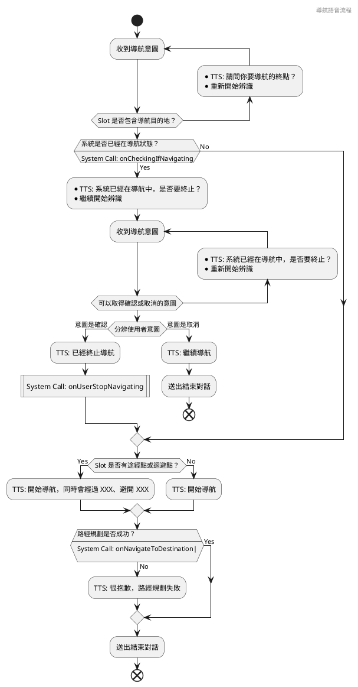

# 設計語音互動流程

在透過 NLU 引擎了解使用者的意圖之後，我們就可以開始嘗試達成對應的任務。我們的對話引擎平時維持一份意圖與流程之間的表格，收到意圖之後，就從表格中取出這段流程執行。

## 語音流程的輸入與輸出

一段語音互動的流程，可能會被稱做 Dialog，在英文中，Dialog 與 Conversation 的意義不太一樣，雖然在中文中都叫做對話，但 Dialog 更具備一種事先安排好，是在劇本當中安排好的兩個角色之間的談話，比起 Conversation，更貼近語音助理要完成任務的過程。也可能稱作 VUI Flow，VUI 是 Voice User Interface 的縮寫。以下我們統稱 VUI Flow。

一段 VUI Flow 會以一個意圖開始，在設計上，我們就不太能夠讓多段不同的 VUI Flow 對應到同一個意圖上，而是一個 VUI Flow，會根據傳入的 Slots 以及當前的系統狀態，走進同一個 VUI Flow 的不同分支。而要完成任務，往往會需要一些必須的 Slot，像是導航就會需要知道目的地，訂餐就會需要品項與數量等。

同時，也可能會有一些非必要的 Slot，但會決定我們如何執行任務，像是導航的語音命令中，可能會多出一個途經點或是迴避點的選項，用戶可能會說「導航到台北動物園，中途經過加油站，但是想辦法避開塞車路段，不要走國道」這樣複雜的句子。遇到必要的 Slot，我們大概就要進入多輪對話追問使用者，一段 VUI Flow，可說就是在蒐集必要的 Slot 的過程。

之後，這段流程往往需要知道一些外部狀態，像是執行前述的導航流程時，我們可能就會想知道目前系統是否已經在導航中，向用戶確認是否需要停止目前的導航工作，如果確定要終止目前的導航，我們才會執行新的導航。

這種向外部詢問狀態，或是要求外部執行工作的呼叫，通常叫做 System Call。這些 System Call 通常也是語音開發者與 App 開發者之間溝通的介面，語音開發者專注在 VUI Flow 的設計與開發，不用關心實際上導航這部份的細節，而 App 開發者也只要專心在這些 System Call 的實作。最後，無論成功或失敗，我們可以回應使用者一段 TTS，最後結束對話。TTS 可以是一段固定的文字，也可以交給 NLG 引擎產生，另外，也可能用一小段音效—像是嗶嗶聲—代替。

所以，我們可以分析出，一段語音互動流程，有著以下的輸入與輸出:

輸入

- Intent
- Slots (必要與非必要)
- 獲取外部狀態的 System Call

輸出

- 執行工作的 System Call
- TTS 回應，或是用一些替代的音效
- 該結束對話，還是該進入下一輪對話，而下一輪對話該是哪個 VUI Flow

## 繪製 VUI Flow 流程圖

根據上述的輸入與輸出，我們通朝用 UML 當中的 [Activity Diagram](https://en.wikipedia.org/wiki/Activity_diagram)，表現對話過程中會有哪些分支。以下以上述的導航流程為例：



在設計一個 VUI Flow 時，我們通常也會附上如何啟動這個流程、滿足可以車取出意圖的例句（Utterance），方便日後的測試以及功能驗證。像是：

- 開始導航
- 我想要去台北動物園
- 帶我去動物園，不要上高架橋…

在上圖中，可以注意到，其實這張圖是多個 VUI Flow 組成的，中間有一段確認是否要終止導航的流程，就是以「確認」、「取消」等意圖，開啟一段新的 VUI Flow。

這個時候，通常會預期只會收到在限制範圍內的意圖，但使用者的行為可能千奇百怪—舉另外一個例子，如果是一套點餐系統，當用戶說「我要點餐」時，我們可能會回應「您想點什麼」，並且預期收到「我要一碗牛肉麵」這樣的回答，但用戶可能會說「有什麼可以點的」，這時候我們可能選擇回覆「我們不理解你的意圖」，或是必須再設計一條分支，念出一些熱門的餐點，然後再問一次想點什麼餐點。流程應該怎麼設計，最後還是要回歸使用者到底怎麼使用，以及團隊的使用者研究的結果。

## VUI Flow 的介面

在實際進入撰寫 VUI Flow 之前，我們先設計一個屬於所有 VUI Flow 的介面。

```dart
abstract class VuiFlow {
  Future<void> handle(NluIntent intent);

  Future<void> cancel() async {
    delegate = null;
  }

  VuiFlowDelegate? delegate;
  String get intent => '';
  List<String> get slots => [];
  String? get additionalNluPrompt => null;
}
```

這個介面分成三個部分：

- 這個 VUI Flow 實際上的工作：當我們要使用這個 VUI Flow 時，會去呼叫 `handle` 這個 method
- 這個 VUI Flow 所需要的外部相依：集中在 delegate 中
- 其他的 metadata：包括什麼意圖會進入這個 VUI Flow，期待收到哪些 Slot，以及是否需要額外的 LLM Prompt 協助抽取 Slot

在 delegate 中，我們定義了一個 VUI Flow 怎麼在中途使用 TTS 引擎與 NLG 引擎，而如果他需要進入另外一輪的對話，可以用 `onSettingCurrentVuiFlow` 指定下一個 VUI Flow 是什麼，並且用 `onStartingAsr` 重新開始 ASR 識別。另外，就是一個用來結束對話的 `onEndingConversation`。

```dart
abstract class VuiFlowDelegate {
  Future<void> onPlayingPrompt(String prompt);
  Future<void> onSettingCurrentVuiFlow(VuiFlow? vuiFlow);
  Future<void> onStartingAsr();
  Future<void> onEndingConversation();
  Future<String?> onGeneratingResponse(String utterance,
      {bool useDefaultPrompt = true});
}
```

另外，使用者可能隨時取消目前正在進行中的 VUI Flow，像是在執行到一半的時候，就按下退出語音助理的按鈕，不但直接關閉 ASR 識別與 TTS 語音，也需要取消正在 `handle` method 中執行的工作。如果要做完整的取消的話，那每個 VUI Flow 中，都需要一個叫做 cancelled 的變數，當這個變數為 true 時，`handle` 裡頭每一行，都要檢查 cancelled 是不是已經變成 true，如果是，就要退出。

在這邊先用了一個偷懶的辦法：只要把 delegate 設成 null 之後，這個 VUI Flow 就不會有對外的聯繫。也不會繼續有 ASR 識別與 TTS 語音，不過 `handle` 其實還是會繼續往下執行。
