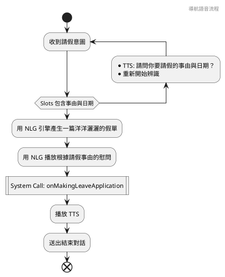
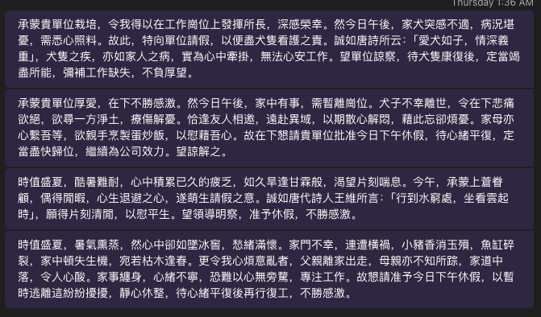

# 實作語音互動流程

我們現在來設計一個個人用的語音助理，可以在我生病在床，一點都不想爬起床的時候，只要用簡單的語音指令，就寫出一篇洋洋灑灑的假單，然後用 Teams 傳給老闆。我們先簡單設計這個助理的流程：



## 定義 Metadata

我們首先繼承 VuiFlow，寫一個自己的 `LeaveApplicationVuiFlow`。由於我們希望 NLU 引擎幫我們抽取出 `LeaveApplication` 這個請假意圖，以及 `Reason` 與 `Date` 兩個 Slots，所以我們要實作 `intent` 與 `slots` 這兩個屬性。

```dart
class LeaveApplicationVuiFlow extends VuiFlow {
  @override
  String get intent => 'LeaveApplication';

  @override
  List<String> get slots => ['Reason', 'Date'];
}
```

## 保留必要的 Slot

我們已經預期需要透過多輪對話，取得日期與事由，所以我們用 date 與 reason 這兩個變數來保留這兩個 Slot 的值。然後，我們希望這個多輪對話有個上限，當對話進行了好幾次，都沒辦法取得日期與事由時，就結束對話，因此，我們加了一個叫做 errorCount 的變數，保存失敗的次數。

```dart
  String? date;
  String? reason;
  var errorCount = 0;
```

## 實作取得必要的 Slot 的流程

我們現在要來開始實作 `handle` method：

```dart
  @override
  Future<void> handle(NluIntent intent) async {
    Future<void> handleMaxError() async {
      await delegate?.onSettingCurrentVuiFlow(null);
      await delegate?.onPlayingPrompt('很抱歉，錯誤次數太多');
      await delegate?.onEndingConversation();
    }

    var date = intent.slots['Date'] ?? this.date;
    var reason = intent.slots['Reason'] ?? this.reason;
    var errorCount = this.errorCount;
    if (date == null || reason == null) {
      final prompt = () {
        if (date == null && reason == null) {
          return '請問您要請假的日期與事由？';
        }
        if (date == null) {
          return '請問您要請假的日期？';
        }
        if (reason == null) {
          return '請問您要請假的事由？';
        }
        return '';
      }();

      errorCount += 1;
      if (errorCount >= _maxErrorCount) {
        await handleMaxError();
        return;
      }
      await delegate?.onPlayingPrompt(prompt);
      await Future.delayed(const Duration(microseconds: 500));
      final vuiFlow = LeaveApplicationVuiFlow(
          onMakingLeaveApplication: onMakingLeaveApplication)
        ..date = date
        ..reason = reason
        ..errorCount = errorCount;
      await delegate?.onSettingCurrentVuiFlow(vuiFlow);
      await delegate?.onStartingAsr();
      return;
    }
    .....
  }
```

在這一部分，我們首先確認，是不是在 intent 中，以及在 LeaveApplication 物件上，已經有了 date 與 errorCount 加一，數量到了一定程度後，就走入 `handleMaxError`。不然，就把 LeaveApplicationVuiFlow 拷貝一份（先忽略 onMakingLeaveApplication），然後把現在的 date、reason 與 errorCount 複製上去，然後告訴 delegate，這就是下一輪對話使用的 VUI Flow，收到任何意圖就要傳到這個 VUI Flow，然後重新開始 ASR 識別。

## 使用 NLG 引擎

```dart
    final promptForApplication =
        '幫我寫一份關於我要請假的短文，語氣嚴謹而且禮貌，大量使用成語，並且引用唐詩，內容大約兩百中文字，不分段'
        '，請假日期是 $date, 事由是 $reason。不要問我其他額外的問題，像是姓名職位等，也不要出現 emoji。';
    final text = await delegate?.onGeneratingResponse(
          promptForApplication,
          useDefaultPrompt: false,
        ) ??
        '';
    final promptForReply =
        "如果一個人發生了 $reason 的狀況，你會怎麼祝他順利呢？只要一句話就好了，不要出現 emoji。";
    final greet = await delegate?.onGeneratingResponse(
          promptForReply,
          useDefaultPrompt: false,
        ) ??
        '';
    await delegate?.onSettingCurrentVuiFlow(null);
    final result = await onMakingLeaveApplication(reason, date, text);
    if (result) {
      await delegate?.onPlayingPrompt('好的，正在幫您請假！$greet');
    } else {
      await delegate?.onPlayingPrompt('很抱歉，無法幫你請假！但我想告訴你，$greet');
    }
    await Future.delayed(const Duration(microseconds: 500));
    await delegate?.onEndingConversation();
```

## 設計 System Call

前面所出現的 `onMakingLeaveApplication`，就是這個 VUI Flow 用來呼叫外部的 System Call，所以我們只要再這個 class 當中定義一個匿名函式

```dart
class LeaveApplicationVuiFlow extends VuiFlow {
  Future<bool> Function(
    String reason,
    String date,
    String text,
  ) onMakingLeaveApplication;

  LeaveApplicationVuiFlow({required this.onMakingLeaveApplication});
  ...
}
```

## 單元測試

要對前面的實作進行單元測試，首先我們 mock 一個 `VuiFlowDelegate`，在這個 mock 中設置好一些特定的條件，像是我們假設 NLG 引擎會有哪些回覆，以及會保存最後一次 TTS 的內容，或是會保存最後一次的 VuiFlow 是什麼。

```dart
class LeaveApplicationMockDelegate extends VuiFlowDelegate {
  final completer = Completer();

  @override
  Future<void> onEndingConversation() async {
    completer.complete();
  }

  @override
  Future<String?> onGeneratingResponse(String utterance,
      {bool useDefaultPrompt = true}) async {
    if (utterance.startsWith('幫我寫一份關於我要請假的短文')) {
      return '我要請假';
    } else if (utterance.startsWith('如果一個人發生了')) {
      return '祝你早日康復';
    }
    return '';
  }

  String? lastPrompt;

  @override
  Future<void> onPlayingPrompt(String prompt) async {
    lastPrompt = prompt;
  }

  VuiFlow? currentVuiFlow;

  @override
  Future<void> onSettingCurrentVuiFlow(VuiFlow? vuiFlow) async {
    currentVuiFlow = vuiFlow;
  }

  @override
  Future<void> onStartingAsr() async {}
}
```

接著就可以寫測試了：

```dart
  test('Test Leave Application VUI Flow - with slots', () async {
    final delegate = LeaveApplicationMockDelegate();
    var systemCallCalled = false;
    final vuiFlow = LeaveApplicationVuiFlow(
        onMakingLeaveApplication: (reason, date, text) async {
      expect(reason, '生病');
      expect(date, '今天');
      expect(text, '我要請假');
      systemCallCalled = true;
      return true;
    })
      ..delegate = delegate;
    final intent = NluIntent(
        intent: 'LeaveApplication', slots: {'Reason': '生病', 'Date': '今天'});
    vuiFlow.handle(intent);
    await delegate.completer.future;
    expect(systemCallCalled, isTrue);
    expect(delegate.lastPrompt, isNotNull);
    expect(delegate.lastPrompt?.contains('祝你早日康復'), isTrue);
  });
```

這個 test case 中，我們只測試了一種狀況，就是用戶一開始就說清楚了請假的事由與日期，然後看看最後的 TTS 對不對，以及最後請假用的 System Call 是否被呼叫了。實務上，這樣的測試只考慮的一個情境，沒有考慮少了某個 slot ，或是一開始就已經在上一輪對話中得到了 slot 的狀況，還需要更多的 case 才能完全覆蓋——在這些 case 中，則需要 assert 是否提供了用做下一輪對話的 VuiFlow 物件，但是因為篇幅的關係，不在此贅述。

## 實際使用 System Call

前面提到，我們想把這份文情並茂的假單，送到老闆的 Teams 上，我們去查了微軟的文件，發現只要透過特定的 URL[^teams]，就可以開啟新的對話，所以我們也可以小段用來開啟這個 URL 的程式：

```dart
class TeamsHelper {
  /// See https://learn.microsoft.com/en-us/microsoftteams/platform/concepts/build-and-test/deep-link-teams#deep-link-to-start-a-new-chatœ
  static sendMessage({
    required String user,
    required String topicName,
    required String message,
  }) {
    final encodedUser = Uri.encodeComponent(user);
    final encodedTopicName = Uri.encodeComponent(topicName);
    final encodedMessage = Uri.encodeComponent(message);

    final url = Uri.parse("https://teams.microsoft.com/l/chat/0/0?"
        "users=$encodedUser&"
        "topicName=$encodedTopicName&"
        "message=$encodedMessage");
    launchUrl(url,
        // mode: LaunchMode.externalApplication
    );
  }
}

```

然後在建立 LeaveApplicationVuiFlow 的時候，傳入我們的實作

```dart
  LeaveApplicationVuiFlow(
        onMakingLeaveApplication: (reason, date, text) async {
      TeamsHelper.sendMessage(
        user: "myboss@mycompany.com",
        topicName: "Leave Application",
        message: text,
      );

      return true;
    })
```

我們可以來看看 Gemini 幫我們產生了哪些精彩的請假事由：



[^teams]: https://learn.microsoft.com/en-us/microsoftteams/platform/concepts/build-and-test/deep-link-teams#deep-link-to-start-a-new-chat
